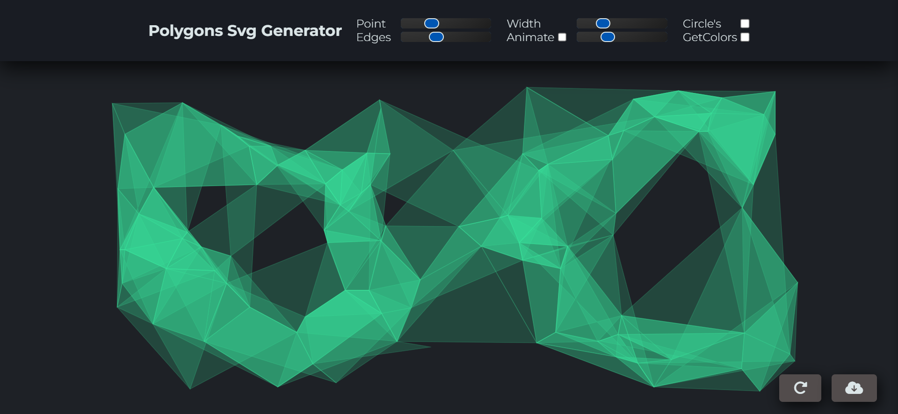

# SVG Generator

SVG Generator is a simple tool that allows you to create random polygons and download them in SVG format. You can adjust various parameters such as the number of points, the number of edges, edge width, and more. Additionally, you can choose whether to display circles around each point or not.

## Key Features

- Create random polygons with customizable parameters.
- Show or hide circles around the points.
- Optional animation to make the polygon move.
- Download the polygon in SVG format.

## How to Use

1. Open the [Demo SVG Generator](https://adityamfu.github.io/SvgGenerator/) or download this project.
2. Customize the desired polygon settings.
3. Click the "Generate" button to create a new polygon.
4. If needed, enable animation by checking the "Animate" box.
5. Click the "Get SVG" button to download the polygon in SVG format.

## Contributing

If you'd like to contribute to this project, you can submit pull requests or report any issues you encounter on the [Clone](https://github.com/adityamfu/SvgGenerator.git) page.

## License

This project is licensed under the MIT License - see the [LICENSE](LICENSE) file for details.
